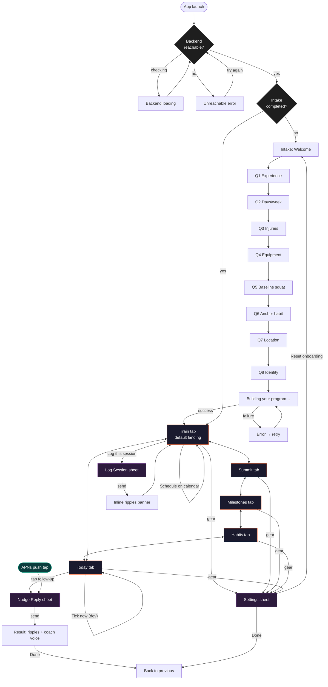

# Flow — the whole app as one diagram

This is the navigation graph. Every arrow is a transition a real user can make. If a transition is missing here, it's missing in the app.

## The five tabs at a glance

The world is exposed as a 5-tab `TabView`. **The tab order is not the spec's 4-level zoom**, it's an interaction order.

| Order | Tab | Section in spec | What it answers |
|---|---|---|---|
| 1 | Train | §4.1 PROMPT/EXECUTE | What do I do *now*? |
| 2 | Summit | §6.1 zoom 1 | What am I becoming? |
| 3 | Milestones | §6.1 zoom 2 | What's the next waypoint? |
| 4 | Habits | §6.1 zoom 3 | Are my systems alive? |
| 5 | Today | §6.1 zoom 4 + §7 | What has the coach said? What's owed? |

> Open question: tabs 2–5 are the spec's zoom 1→4, in that order. Tab 1 (Train) is *prepended* because a fresh user otherwise lands on a blank Summit with no action. Is "Train" the right name, or is it really "Now"? See `03-train-tab.md`.

## Hidden / asynchronous entry points

These are entries the user doesn't navigate to — they arrive from outside the app:

- **APNs nudge push** → `NudgeReplyView` modal (skips the tab bar entirely)
- **Background tick** → may produce a new nudge that surfaces on Today tab on next refresh
- **Follow-up owed** → surfaces in the Today tab as a tappable card → `NudgeReplyView`

> Open question: should APNs taps deep-link to a specific tab (e.g. Train) after the reply sheet dismisses? Right now it returns to wherever the user was.

## Loop-closing edges (Rubric A4)

The coach's whole value rests on closing the loop: ASK → REPLY. Edges that close the loop:

1. `Train → LogSheet → ripples → back to Train` (in-app self-report)
2. `APNs push → NudgeReply → ripples → previous screen` (push-driven self-report)
3. `Today → follow-up card → NudgeReply → ripples → Today` (rescue path for missed nudges)

If any of these three is broken, C1 ("useful without opening") and A4 ("loop-closing") fall.
