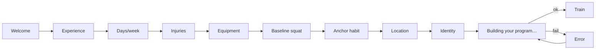

# 02 — Intake (the conversation)

The 8-question onboarding flow that bootstraps the coach. This is the highest-risk surface in the app — if intake breaks the user's trust, the entire copilot is dead.

## Role

Intake produces the inputs the persona needs to derive a real program (spec §4.1.1). The spec frames it as a *conversation*, not a form. This implementation relaxes that for HIG-native pickers/steppers so the LLM gets cleaner structured answers, but the framing — one question per screen, identity statement last — is preserved.

The flow ends with "**Who are you becoming?**" — the identity statement — because everything downstream (the summit, the votes, the ripples) measures progress *against this statement*, not against pounds lifted.

## Sub-flow



Each question screen has a back chevron except Q1 (which can only return to Welcome, but Welcome isn't a step).

## Wireframe — Welcome

```
┌─────────────────────────────┐
│                             │
│            ⛰                │  ← ember mountain icon, glowing
│         (radial glow)       │
│                             │
│       The Coach             │  ← display rounded heavy
│                             │
│  A copilot that pushes      │
│  when it matters and stays  │
│  out of the way when it     │
│  doesn't.                   │
│                             │
│   [    Get started    ]     │  ← ember button
│                             │
│  A few quick questions —    │
│  about a minute.            │  ← muted caption
│                             │
└─────────────────────────────┘
```

## Wireframe — Question (generic, single-select)

Example: Q1 Experience.

```
┌─────────────────────────────┐
│ < Back        1 of 8        │  ← nav: back + step counter
├─────────────────────────────┤
│                             │
│ Your strength-training      │  ← serif title (big)
│ experience?                 │
│                             │
│ We'll use this to calibrate │  ← subtitle (muted)
│ starting loads.             │
│                             │
│  ○ None — never trained     │  ← radio rows
│  ● Novice — under 6 months  │     (selected: ember)
│  ○ Intermediate — 1+ year   │
│  ○ Advanced — 3+ years      │
│                             │
├─────────────────────────────┤
│ ▓▓░░░░░░░░░░░░░░░░░░░░░░░    │  ← gradient progress
│ [        Continue       ]   │  ← cta
└─────────────────────────────┘
```

## Wireframe — Stepper (Q2 Days/week)

```
┌─────────────────────────────┐
│ < Back        2 of 8        │
├─────────────────────────────┤
│ How many days a week can    │
│ you train?                  │
│ Honest is better than       │
│ ambitious.                  │
│                             │
│        ─        ─           │
│      ─       3        +     │  ← big numeric display
│        ─    days/wk   ─     │     between two stepper buttons
│        ─        ─           │
│       (range 2–4)           │
├─────────────────────────────┤
│ ▓▓▓▓░░░░░░░░░░░░░░░░░░       │
│ [        Continue       ]   │
└─────────────────────────────┘
```

## Wireframe — Free-text with skip pill (Q3 Injuries)

```
┌─────────────────────────────┐
│ < Back        3 of 8        │
├─────────────────────────────┤
│ Any current pain or         │
│ injuries to work around?    │
│ If something hurts, the     │
│ coach holds back.           │
│                             │
│ ┌─────────────────────────┐ │
│ │ Describe anything to be │ │  ← multi-line textfield
│ │ careful with…           │ │     (3–5 lines)
│ └─────────────────────────┘ │
│  [✓ Nothing — I'm good]     │  ← capsule pill skip
├─────────────────────────────┤
│ ▓▓▓▓▓▓░░░░░░░░░░░░░░         │
│ [        Continue       ]   │
└─────────────────────────────┘
```

## Wireframe — Conditional numeric (Q5 Baseline squat)

```
┌─────────────────────────────┐
│ < Back        5 of 8        │
├─────────────────────────────┤
│ Most you can squat for 5    │
│ reps?                       │
│ Good form, not a max.       │
│                             │
│  I'm not sure         ( ◯ ) │  ← switch
│                             │
│ ┌─────────────────────────┐ │
│ │           225  lb        │ │  ← big numeric input
│ └─────────────────────────┘ │     (disabled when switch on)
├─────────────────────────────┤
│ ▓▓▓▓▓▓▓▓▓▓░░░░░░░░░░         │
│ [        Continue       ]   │
└─────────────────────────────┘
```

## Wireframe — Identity (Q8, final)

```
┌─────────────────────────────┐
│ < Back        8 of 8        │
├─────────────────────────────┤
│ Who are you becoming?       │  ← serif, big
│ One sentence. This becomes  │
│ your summit.                │
│                             │
│ ┌─────────────────────────┐ │
│ │ e.g. someone who shows  │ │  ← serif, italic prompt
│ │ up, even when tired     │ │     (2–4 lines)
│ └─────────────────────────┘ │
│                             │
│ The coach measures progress │
│ against this, not pounds    │
│ lifted.                     │
├─────────────────────────────┤
│ ▓▓▓▓▓▓▓▓▓▓▓▓▓▓▓▓▓▓▓▓▓▓▓     │
│ [   Build my program    ]   │  ← cta label changes on last step
└─────────────────────────────┘
```

## Wireframe — Submitting

```
┌─────────────────────────────┐
│                             │
│                             │
│           ⛰                │  ← ember mountain inside
│        (spinning ring)      │     a partial-trim ring
│                             │
│   Building your program     │
│   This usually takes a      │
│   second.                   │
│                             │
└─────────────────────────────┘
```

If submission fails: full-screen `ErrorView` with "Couldn't build your program" + retry.

## All 8 questions and what they shape

| # | Field | Type | Drives |
|---|---|---|---|
| 1 | `experience` | single-select | Starting load + progression aggressiveness |
| 2 | `days_per_week` | stepper 2–4 | Program frequency |
| 3 | `injuries` | text | Safety holds (spec §4.4) + exercise selection |
| 4 | `equipment` | single-select | Exercise palette |
| 5 | `baseline_squat` | numeric or "unsure" | Initial squat 1RM/5RM estimate |
| 6 | `anchor_habit` | text | "After X, I train" — implementation intention cue |
| 7 | `training_location` | text | "…at LOCATION" — implementation intention place |
| 8 | `identity_statement` | text | The summit. Measured against, not numeric. |

Questions 6+7+8 together form an Atomic Habits implementation intention surfaced in the Train tab as **The Script**.

## Enters from

- App launch → Backend reachable → `hasCompletedIntake == false`
- Settings → **Reset onboarding** (returns user here)

## Exits to

- `Q8 → Submit → success` → **Train tab** (default landing of WorldView)
- `Q8 → Submit → failure` → inline retry within the submitting screen
- **No exit during intake** — there's no way to back out to nothing. The back button stops at Q1.

## UX questions

- **8 questions feels like 8 too many for some users; 8 too few for others.** Is there a "fast path" (e.g. 3 critical questions → derived defaults for the rest) and a "thorough path"? The spec wants a *conversation*, which this isn't — should the LLM be in the loop for follow-up questions rather than fixed forms?
- **The back chevron is disabled on Q1.** That means once you start, the only way out is to finish. Is that the right level of commitment to ask for in the first 60 seconds?
- **Q5 (baseline squat) is fitness-specific.** When persona #2 ships (spec §10), intake screens need to be persona-authored, not hardcoded. The intake flow is currently the most persona-coupled part of the app.
- **Q8 (identity) is asked cold.** A user who's never thought about identity won't know what to write. Is there scaffolding — an example carousel, an "I'll come back to this" defer?
- **No preview of the program before commit.** The user answers 8 questions, hits Build, and lands on a fait accompli. Should there be a "here's what we'll do — confirm?" step?
- **No save/resume.** If a user closes the app at Q5, they restart at Q1. Worth persisting partial state to `SessionStore`?
- **Skipped state for injuries lives as a pill, not a switch.** Q5 uses a switch ("I'm not sure"). Inconsistent. One or the other.
