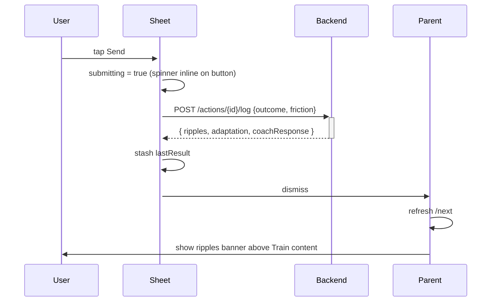

# 04 — Log Session sheet

The modal that closes the loop from inside the app. Posts a report against the prescribed action, which feeds adaptation.

## Role

REPORT step of the master loop (spec §4.1). Every session the user does produces a `VerifiedEvent`, which is the only thing allowed to grow the world (§6.3). This sheet is also the only in-app way to report "skipped" honestly — pushing the user to do that beats letting them ghost.

The same backend endpoint (`POST /actions/{id}/log`) is hit by both this sheet and the **I did the minimum** button on the Train tab. The friction note is the input that feeds *adaptation rationale* — what the next session will change.

## Wireframe

```
┌─────────────────────────────┐
│ Cancel    Log session       │  ← sheet nav
├─────────────────────────────┤
│ ┌─────────────────────────┐ │
│ │ FULL A                  │ │  ← session name eyebrow
│ │                         │ │
│ │ How did it go?          │ │  ← title
│ │                         │ │
│ │ [ Done | Partial | Skip]│ │  ← segmented picker
│ │       (Done selected)   │ │
│ └─────────────────────────┘ │
│                             │
│ ┌─────────────────────────┐ │
│ │ FRICTION NOTE           │ │  ← eyebrow
│ │ ┌─────────────────────┐ │ │
│ │ │ What got in the way?│ │ │  ← multi-line textfield
│ │ │ (optional)          │ │ │     (2–5 lines)
│ │ └─────────────────────┘ │ │
│ │                         │ │
│ │ This feeds adaptation — │ │  ← muted caption
│ │ the next session changes│ │
│ │ based on what you       │ │
│ │ report.                 │ │
│ └─────────────────────────┘ │
│                             │
│ [        Send         ]     │  ← ember cta
└─────────────────────────────┘
```

## Outcome options

| Option | What the brain does | When to choose |
|---|---|---|
| **Done** | counts as a verified vote; world grows; progression advances if rule met | finished the session |
| **Partial** | holds load — no progression, no punishment | did some sets but not all |
| **Skipped** | logged; no judgement; back-off applies | didn't train |

> The push-notification reply sheet (`NudgeReplyView`, see `09-nudge-reply.md`) has five outcomes: Done / Partial / Not now / Busy / Skipped. The in-app sheet has three. The extra two (Not now, Busy) are nudge-specific timing replies, not session-outcome replies — they don't make sense without a nudge that just fired.

## Submit flow



The coach's spoken acknowledgment (`coachResponse`) is **not** rendered in this sheet today — only in `NudgeReplyView`. The Train sheet jumps straight to "ripples banner above the new prescription". Open question below.

## Content states

| State | Trigger | Visual |
|---|---|---|
| Idle | Sheet opens | form fields, no spinner |
| Sending | Send tapped | button shows spinner + "Sending…", disabled |
| Sent | Backend returned | sheet dismisses (no in-sheet result UI) |

Failure today is silent — the sheet still dismisses on a 4xx/5xx because the call is `try?`'d. **This is a bug shape worth flagging.**

## Enters from

- Train tab → **Log this session** button → presented as `.sheet` with `presentationDetents([.medium, .large])`

## Exits to

- **Cancel** → dismiss, no change
- **Send → success** → dismiss → return to Train tab → ripples banner inline
- **Send → failure (silent today)** → dismiss → return to Train tab with no banner → user is confused

## UX questions

- **Three outcomes vs five.** The sheet and the push reply diverge. Should they unify? "Skipped" with a "couldn't start" reason captures most of what "Busy" + "Not now" mean.
- **The coach's voice is missing here.** When the user does the work and tells the coach, the coach should *speak back*. Currently the sheet jumps to ripples without surfacing `coachResponse`. Either inline it before dismissing, or always route through a result screen.
- **Silent failure on send.** No toast, no error state. The user thinks they logged but nothing happened. A small inline error banner inside the sheet (without dismissing on failure) is the minimum bar.
- **Friction note is buried under outcome.** For users who pick "Partial" or "Skipped", the friction note is the *most important* input. Should the form re-order based on outcome — pushing friction up when not Done?
- **No "what I actually did" log.** A user who did 3×5 at 145 lb has no way to record actual reps/load. The brain treats Done as the prescription having been carried out exactly. For honesty, should there be a "deviation" field — even just "lighter / same / heavier"?
- **No undo.** Logged is logged. World grew. If the user fat-fingers Done when they meant Skipped, the only recourse is logging the next session honestly. Worth a 5-second undo toast?
