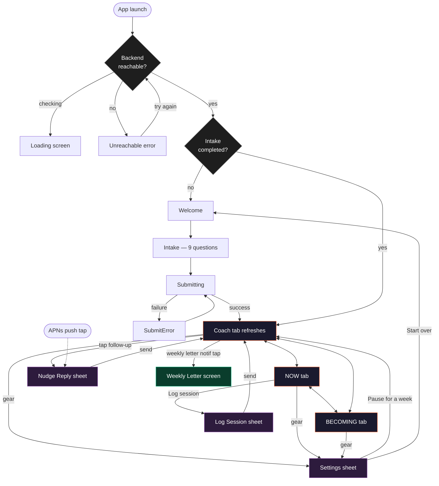
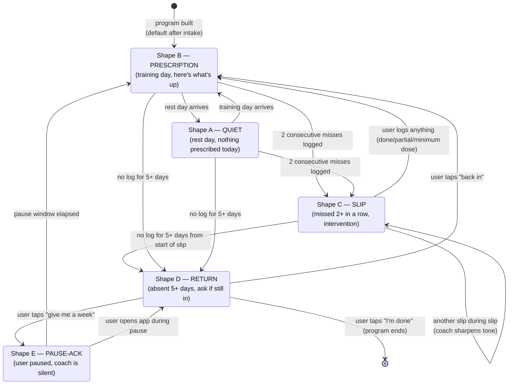

# v2 Flow

Two diagrams: the navigation graph (what tab leads to what) and the Coach-tab state machine (which shape the user sees based on their state).

The state machine is the **differentiator surface**. Most apps have one main screen. We have one tab whose contents change based on whether the user is on track, slipping, or gone — and the transitions between those states are the product.

## Navigation graph

## The Coach-tab state machine

The Coach tab is one tab with five possible shapes. The backend decides which shape to render based on user state. The user never picks a shape — the coach picks.

### Trigger summary

| Transition | Trigger | Server-side check |
|---|---|---|
| → Shape B | program built; training day arrives | `next_session.scheduled_for == today` |
| → Shape A | rest day | `next_session.scheduled_for > today` |
| → Shape C | 2nd consecutive miss logged OR 2nd consecutive missed-without-log day | `consecutive_misses >= 2` |
| → Shape D | no `VerifiedEvent` for 5 days | `days_since_last_event >= 5` |
| → Shape E | user tapped "give me a week" | `pause.until > now` |
| ← from Shape D back to B | user tapped "back in" on Shape D | resume action persisted |
| ← from Shape C back to B | user logged anything | new event clears the slip flag |

> The slip detection is two independent signals: missed-with-log (user reported "skipped") and missed-without-log (cron passed the scheduled time with no event). Either counts toward the consecutive-miss counter. This is critical — the user who silently ghosts is the user who's about to drop off.

## Loop-closing edges (preserved from v1, expanded)

Every value-creating action in the app must close the loop. The five edges:

1. **Prescription → execution** — Now tab shows what to do.
2. **Execution → report** — Log Session sheet or push reply.
3. **Report → adaptation** — coach voice acknowledges; next prescription changes.
4. **Slip → intervention** — Coach Shape C (the new edge in v2).
5. **Absence → re-engagement** — Coach Shape D (the new edge in v2).

The 4th and 5th are the v2 additions. They are the moat.

## The weekly letter as a notification-triggered surface

Once a week, on Sunday at 18:00 local time (configurable), the backend generates a weekly letter and fires a push:

> *Sunday — your week.*

Tapping the push opens `WeeklyLetterView` directly, full-screen, bypassing tabs. From the letter the user can:
- Read it (default)
- Save to Photos (system share, screenshot the rendered surface)
- Dismiss back to wherever they were

The letter is also reachable from the Coach tab via a small "this week's letter" card on Sundays only. After Wednesday the card disappears — the letter goes into the becoming tab's history section.

## Pause states are explicit, not implicit

In v1, a user who needed a break could only get one by ignoring the app until the brain backed off. That's the failure-shaped path.

In v2, **rest is a command**, not a side effect. From Settings:

- **Pause for a week** → Shape E for 7 days; coach goes silent; push notifications suppressed; auto-resumes next Sunday with Shape B.
- **Pause for a month** → Shape E for 30 days; coach goes silent; **does not auto-resume** — user opens the app and triggers Shape D ("Haven't seen you in a bit. Still in?") on return.

This is the Atomic-Habits-Ch.13-meets-real-life mechanic: skipping is a vote for who you're becoming, *but so is paying attention to recovery*. The app should make rest a first-class win, not a reluctant tolerance.

## What's silent in v2 (and why)

- **Streak counter.** Removed. The single biggest dropout cause in the literature. (See `screens/01-coach-tab.md` for what replaces it as the visible metric: votes cast.)
- **"Tick now" dev button.** Behind `#if DEBUG`. Production users do not see backend internals.
- **Backend URL.** Hidden in production Settings.
- **Tab badges / red dots.** No persistent unread indicators. The coach decides when to interrupt; the user does not "have unread messages" they need to clear. (This is the push-not-pull principle applied to UI affordances.)
