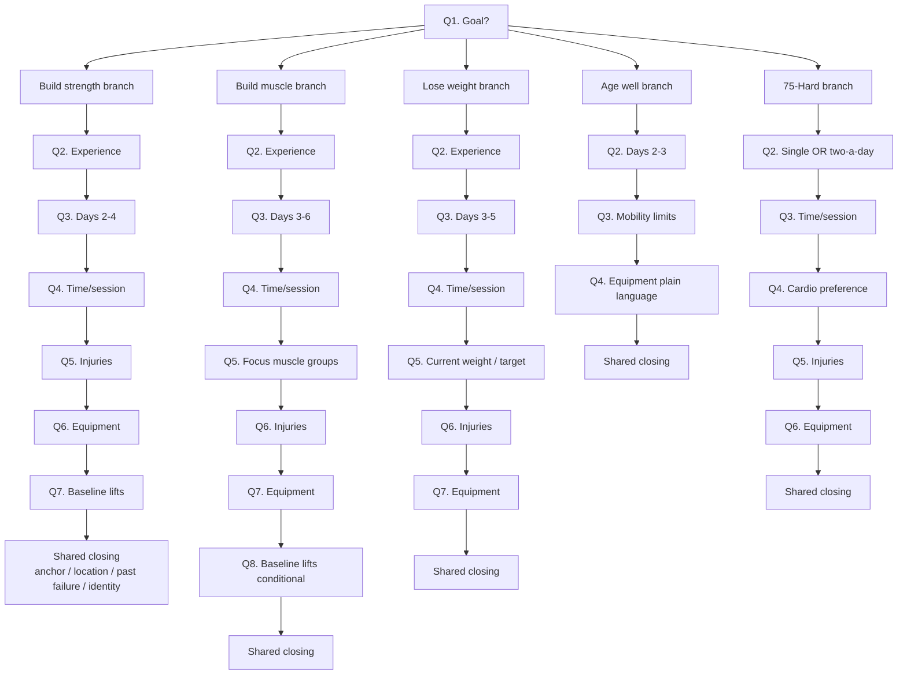

# Program templates — the engine behind the goal-first onboarding

Five templates, one per goal. The user picks a goal during onboarding (new Q1 in v2 intake); the template determines the program structure, the question branches that follow, the exercise palette, and the adaptation rules. **Same engine, different programs.**

This directory is the brief for each template — designer-readable program logic before any Python is written. Each file describes what the template does, who picks it, the split / rep ranges / progression / sample week, equipment branches, special considerations, and what the milestones look like.

## The five templates at a glance

| Template | Goal selected | Split | Default days | Time/session | Source tradition |
|---|---|---|---|---|---|
| [01 — Strength](01-strength.md) | "Get stronger" | Full body A/B alternating | 3 | 45 min | Starting Strength / GZCLP |
| [02 — Hypertrophy](02-hypertrophy.md) | "Build muscle" | Upper/Lower (4d) or PPL (6d) | 4 | 60 min | Renaissance Periodization, classic bodybuilding |
| [03 — Conditioning](03-conditioning.md) | "Lose weight, get fit" | Full body + 2 conditioning days | 4 (3 lift + 2 conditioning) | 30-45 min | CrossFit-lite, hybrid functional fitness |
| [04 — Longevity](04-longevity.md) | "Stay fit, age well" | Full body, low-impact | 2-3 | 30 min | Functional training, Peter Attia's "Centenarian Decathlon" |
| [05 — Discipline](05-discipline.md) | "75-Hard-style discipline" | 6 days, two-a-days, strict | 6 | 45 min × 2 | 75 Hard ethos |

## What's shared across all templates

Every template conforms to the `Persona` interface defined in `backend/coach/personas/base.py`:

```python
class Persona:
    intake_questions: list[IntakeQuestion]   # what the persona needs to know
    build_program: Callable[UserProfile, (ProgramState, list[Milestone], list[Habit])]
    next_session: Callable[(ProgramState, UserProfile), Session]
    progression_rules: Callable[(ProgramState, list[Report]), (ProgramState, str)]
```

This is the spec's **§G2 Authorable personas** principle in action — adding a template is authoring a new persona file, not editing the engine. The current `fitness.py` becomes `personas/strength.py` (refactored). The other four are new files.

## What's shared in user-facing experience

Regardless of which template a user picks:

- **Marcus voice** governs all coach-spoken strings (see `../../voice/`)
- **Mirror principle** — the world grows only from verified events
- **Slip-day intervention** (Coach tab Shape C) fires the same way
- **Return-after-absence** (Shape D) fires the same way
- **Weekly letter** ships Sunday for everyone
- **Implementation intention** (The Script) is built from intake answers in every template
- **Composable-blocks architecture** — templates pick from the same shared block palette

The user picks a goal once. After that, the experience SHAPE is consistent — only the programming differs.

## What each template owns differently

| Concern | Why it varies |
|---|---|
| Split structure | A hypertrophy user trains different days than a longevity user |
| Rep ranges | 5s for strength, 8-12 for hypertrophy, 12-15+ for conditioning, varied for longevity |
| Progression rules | Linear works for novices; intermediates need double progression or wave loading; longevity barely progresses |
| Session length | Discipline user can do 90 min; busy executive can do 30 |
| Required vs optional accessories | Strength template skips isolation; hypertrophy requires it |
| HealthKit usage | Conditioning leans hard on weight; longevity on sleep + walking; discipline on photos |
| Intake question branches | Strength asks baseline lifts; longevity doesn't; discipline asks two-a-day cadence |
| Voice register | Discipline gets sharper Marcus; longevity gets warmer-and-slower Marcus |
| Photo block | Required for discipline, optional for others |

## Onboarding flow as a tree

Goal-first onboarding is a *tree*, not a linear form. Different goals collect different subsequent inputs.



The shared closing — anchor, location, past failure, identity — is constant across goals. The middle section adapts per goal.

This is why the persona interface owns `intake_questions: list[IntakeQuestion]` — each persona declares its own intake branch.

## How users see this in the app

After picking a goal:

- **Welcome message updates:** *"Picked strength. Good. Few quick questions."*
- **Intake feels right-sized:** strength user answers 9 questions; longevity user answers 7; discipline user answers 8.
- **Submitting copy adapts:** *"Putting your strength program together."* / *"...your hypertrophy program..."* / etc.
- **First prescription is shape-correct:** strength user lands on Workout A; hypertrophy user lands on Upper Day 1; longevity user lands on Full Body — Easy Start.

## What's NOT in this directory

- The **block compositions** for each template's surface. That's in `../composable-blocks.md` — each template's default composition is documented there.
- The **voice register tuning** per template. That's in `../../voice/voice-spec.md` § Tone calibration — sub-archetypes per persona.
- The **migration story** for users who picked the wrong goal. Brief: Settings → "change goal" → re-runs the goal-branch portion of intake; existing history preserved.

## Implementation order (proposed)

When we move from design → code:

1. **Strength** (01) — already exists; just refactor the file structure and add the goal-aware intake fields. **Day 1-2.**
2. **Hypertrophy** (02) — most demanded by market (Tyler persona). Adds the second template, validates the multi-persona engine. **Days 3-7.**
3. **Conditioning** (03) — biggest segment by population (the "I want to lose weight" market). Needs cardio block + HealthKit weight integration. **Week 2.**
4. **Discipline** (05) — needs photo block + strict scheduler. Hardest UI work. **Week 3.**
5. **Longevity** (04) — smallest segment, but the most underserved. Simple programming but vocabulary work is real. **Week 4.**

Total: ~4 weeks from design freeze to all 5 in production. Strength can ship in v1.1 standalone if we want a quick demo of the goal-first system.

## Open design decisions still to make

- **Can a user run two templates simultaneously?** (e.g. hypertrophy + conditioning.) Probably no for v2 — adds complexity, splits the coach's attention, dilutes the signal. Pick one.
- **Can the brain *suggest* a template change?** E.g. a hypertrophy user who reports terrible sleep and stress for 4 weeks gets *"this might be a conditioning phase. let's switch."* Yes in spirit (it's the coach's job), no in v2 (too aggressive a behavior for initial launch).
- **What happens when a user outgrows their template?** A novice on strength who hits 1.5× bodyweight squat and stalls is intermediate. They should either get an automatic graduation prompt or have a Settings affordance. **TBD per template** — each `.md` will name its graduation path.
- **Should some templates require a paid tier?** Discipline is the obvious candidate (more brand, more support, more strictness). Not deciding here — flagged for product-monetization later.

Start with [`01-strength.md`](01-strength.md) — it's the current state, just refactored cleanly. The others build on the patterns it establishes.
